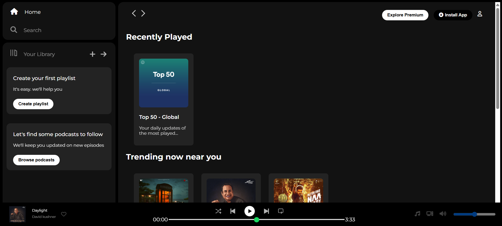

# 🎵 Spotify Clone

A simple and responsive **Spotify UI Clone** made using **HTML** and **CSS**. This project replicates the look and feel of Spotify’s web player interface.

---

## ✨ Features

- 🎶 Attractive landing page similar to Spotify
- 📱 Responsive design for various screen sizes
- 🎨 Smooth and clean UI with custom CSS styling
- 🖼️ Organized assets inside an `Images/` folder

---

## 🛠️ Tech Stack

- **HTML5** for markup structure
- **CSS3** for styling and layout

---

## 📂 Project Structure

```
Spotify-Clone/
├── index.html
├── style.css
└── Images/
    └── homepage-screenshot.png  # Screenshot for README
```

---

## 📸 Screenshots

### 🏠 Homepage Preview



---

## 🚀 How to Run

1. **Clone the repository**:
   ```bash
   git clone https://github.com/NamraPatel17/Spotify-Clone.git
   ```
2. **Navigate into the directory**:
   ```bash
   cd Spotify-Clone
   ```
3. **Open** `index.html` in your web browser.

---

## 🤝 Contributing

Contributions are welcome! Feel free to fork the repo, make your changes, and submit a pull request.

---

## 📄 License

This project is open-source.
